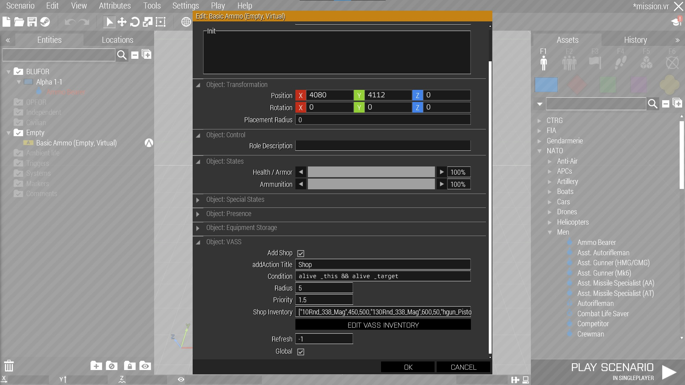
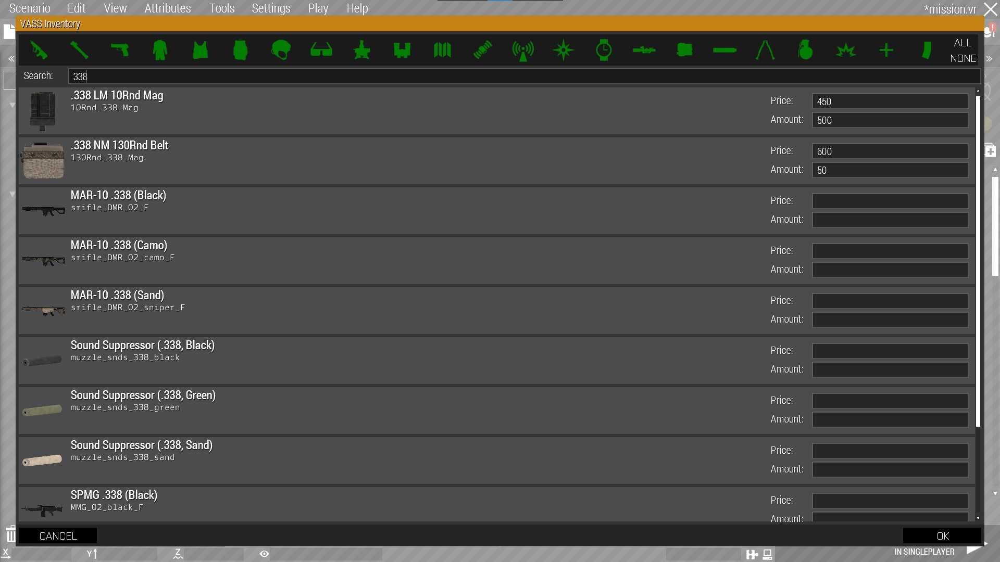

## System  
The system consists of several functions and configs which turn the Virtual Arsenal into a place where you can trade items for money and vice versa. A money system is not provided as of now. Instead you have the opportunity to implement your own one, like Ravage.<br/>
To make editing this system easier I have also created a mod which will let you set the attributes of a trader directly in 3den without creating a dependency:<br/>
https://steamcommunity.com/sharedfiles/filedetails/?id=1760193128

## Setup  
### Init
Copy the files from the master branch to your mission directory where the mission.sqm is located. The function which initializes the system is called automatically before each mission start. 

### Add trader
With `TER_fnc_addShop` you can register objects and units as traders.

### Add shop inventory
The function `TER_fnc_addShopCargo` handles the list of items which a trader sells or buys.
  
## Functions
This are the currently available functions which can be used to influence the system:<br/>
### TER_fnc_addShop
```
/*
	Author: Terra

	Description:
		Add shop action to an object. Any previous actions of this type are
		removed. VASS is only activated when the arsenal is opened via this
		function.

	Parameter(s):
		0:	OBJECT - Object to which the action is attached
		Optional:
		1:	STRING - Title of the action
			Default: "Shop"
		2:	NUMBER - Priority of the action, higher values mean the entry will appear first in the scroll wheel menu
			Default: 1.5
		3:	STRING - Condition for the addAction to show
			Default: "alive _this && alive _target"
		4:	NUMBER - Radius of the addAction
			Default: 5

	Returns:
		NUMBER - ID of the action, also saved as "TER_VASS_actionID" on the object

	Example(s):
		[cursorObject] call TER_fnc_addShop; //-> 0
		[cursorObject, "BLUFOR Weapon Shop", 999, "playerSide == west", 15] call TER_fnc_addShop; //-> 1
*/
```
### TER_fnc_addShopCargo
```
/*
	Author: Terra

	Description:
		Change the inventory of a shop.

	Parameter(s):
		0:	OBJECT - The object whose shop inventory will be changed
		1:	ARRAY - List of items, prices and amounts to add
				Format: ["class0", price, amount, "class1", price, amount,..., "classN", price, amount]
					Class: STRING - Class name of the item
					Price: NUMBER - The cost of the item
					Amount: NUMBER or BOOL - How many items the trader has. True means unlimited, false removes it from the inventory.
		Optional:
		2:	NUMBER - Overwrite mode:
				0 - Don't overwrite, only add new things
				1 - (default) Overwrite soft, only adjust prices and add new things
				2 - Hard overwrite, the passed array becomes the new inventory
				3 - Overwrite old, don't add new entries, only modify old ones
				4 - Amount diff, add/substract amounts
		3:	BOOL - BOOL - Change inventory for all players. If not specified, the _object's "TER_VASS_shared" variable is used. If this isn't set either it defaults to true.

	Returns:
		ARRAY - New shop cargo array

	Example(s):
		[cursorObject, ["50Rnd_570x28_SMG_03",50,40,"SMG_03_black",1000,5] call TER_fnc_addShopCargo; //-> ["50Rnd_570x28_SMG_03",50,40,"SMG_03_black",1000,5]
		[cursorObject, ["10Rnd_338_Mag",1000,5], 0, true] call TER_fnc_addShopCargo; //-> ["50Rnd_570x28_SMG_03",50,40,"SMG_03_black",1000,5,"10Rnd_338_Mag",1000,5]
		[cursorObject, ["10Rnd_338_Mag",1000,5], 2, true] call TER_fnc_addShopCargo; //-> ["10Rnd_338_Mag",1000,5]
*/
```
### TER_fnc_getItemValues
```
/*
	Author: Terra

	Description:
		Get the price and amount of an item in a shop.

	Parameter(s):
		0:	OBJECT - Shop object
		1:	STRING - Classname of the item
		Optional:
		2:	NUMBER - Type of return:
				0: class
				1: price
				2: amount
				-1: array of [class, price, amount]
			Default: -1
		3:	ARRAY - Default return when item is not in the shop
			Default: [parameter 0, 0, -1]

	Returns:
		ARRAY or STRING or NUMBER - Depending on param 2, the requested value

	Example(s):
		[cursorObject, "SMG_03_black"] call TER_fnc_getItemValues; //-> ["SMG_03_black", 1000, 5]
		[cursorObject, "SMG_03_black", 1] call TER_fnc_getItemValues; //-> 1000
		[cursorObject, "bogus", nil, ["bogus", 1234, 56]] call TER_fnc_getItemValues; //-> ["bogus", 1234, 56]
*/
```
### TER_fnc_resetTimer
```
/*
	Author: Terra

	Description:
		Change the items of a shop after a certain time.

	Parameter(s):
		0:	OBJECT - Shop object
		1:	ARRAY or BOOL - List of items to readd/remove or true to reset the inventory to default
		Optional:
		2:	NUMBER - Time until reset. Negative values will use the "TER_VASS_refresh" variable from the object.
			Default: -1
		3:	BOOL - Passed items will become the only ones after reset. If items is true then it is automatically set to reset.
			Default: false

	Returns:
		BOOL - true when done

	Example(s):
		[cursorObject, ["10Rnd_338_Mag",1000,5,"50Rnd_570x28_SMG_03",50,40,"SMG_03_black",1000,5]] spawn TER_fnc_resetTimer; //-> Script handle
		[cursorObject, ["10Rnd_338_Mag",1000,5,"50Rnd_570x28_SMG_03",50,40,"SMG_03_black",1000,5], 59, true] spawn TER_fnc_resetTimer; //-> Script handle
*/
```
### TER_fnc_VASShandler
```
/*
	Author: Terra

	Description:
		This is meant as an "API" of sorts. The following modes are available:
		"getMoney":
			Description:
				Get the money of the given unit
			Parameter(s):
				0:	OBJECT - The unit whose money is checked
			Returns:
				NUMBER - Money of the unit
		"setMoney":
			Description:
				Set the money of the given unit
			Parameter(s):
				0:	OBJECT - The unit whose money is modified
				1:	NUMBER - Change (not final amount, that is up to this function!)
			Returns:
				NOTHING - No return expected


	Parameter(s):
		0:	STRING - Mode
		Optional:
		1:	ARRAY - Parameters passed to the different modes
			Default: []

	Returns:
		ANY - Whatever the mode returns

	Example(s):
		["getMoney", [player]] call TER_fnc_VASShandler; //-> 0
		["setMoney", [player, -5900]] call TER_fnc_VASShandler; //-> nil
*/
```

## Screenshots
### Ingame
<br>
As you can see the prices of the items are listed right next to it in a green color. The lists are also sortable by either name, price from low to high and high to low.<br>
<br>
<br>
When setting a maximum amount of items which can be added to one of the containers (uniform, vest, backpack) this maximum amount is also displayed next to the current amount. Items which are not part of the shop are set to a cost of 0.<br>
<br>
<br>
Before leaving the shop the player can see what they will buy or sell. When leaving the shop any other way than over this menu then the loadout will be reset to the one with which he entered the shop.

### 3den Editor
<br>
The 3den mod adds a new section to the attributes in 3den. You can set
- Title
- Condition
- Radius
- Priority

of the addAction. Additionaly you can copy and paste the shop's inventory or edit it in the UI by clicking the "EDIT VASS INVENTORY" button. You can also set the time the shop takes to refresh (see [TER_fnc_resetTimer](#TER_fnc_resetTimer)) and the [locality](https://community.bistudio.com/wiki/Multiplayer_Scripting) of the whole shop.

<br>
You can use the VASS Inventory UI to edit the shop's cargo array. You can include or exclude item types in your search by toggling them in the toolbox at the top. To apply your changes you have to confirm by clicking the OK button on the UI and then the OK button on the Attributes window in 3den.

# License
This project is licensed under the [GNU General Public License v3.0](https://choosealicense.com/licenses/gpl-3.0/).
