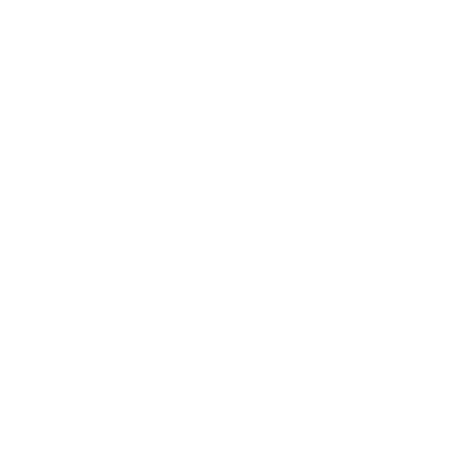
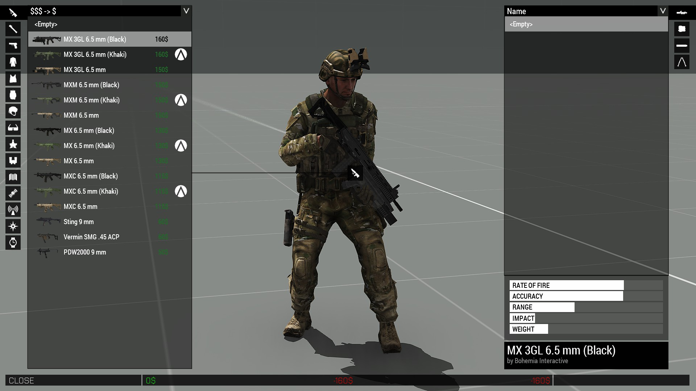
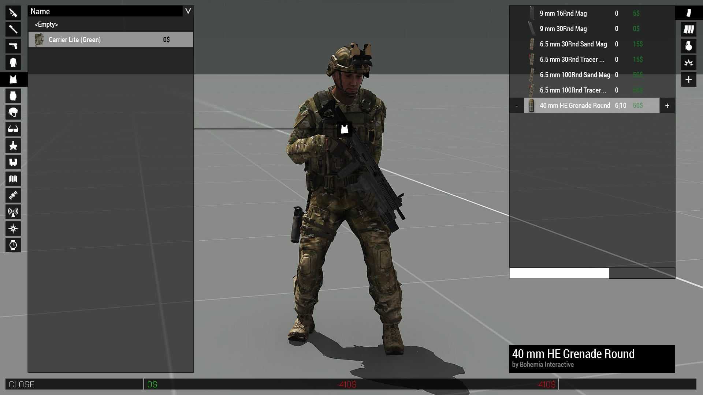
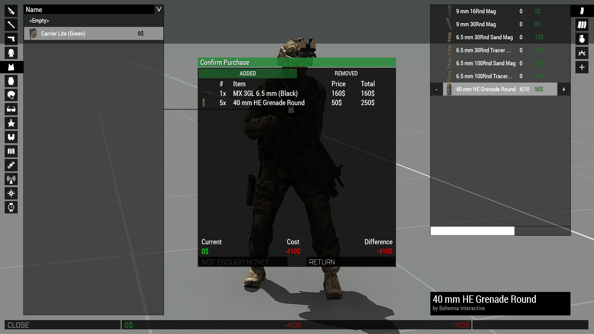

## System  
The system consists of several functions and configs which turn the Virtual Arsenal into a place where you can trade items for money and vice versa. A money system is not provided as of now. Instead you have the opportunity to implement your own one, like Ravage.<br/>
To make editing this system easier I have also created a mod which will let you set the attributes of a trader directly in 3den without creating a dependency:<br/>
https://steamcommunity.com/sharedfiles/filedetails/?id=1760193128

## Setup  
### Init
Copy the files from the master branch to your mission directory where the mission.sqm is located. The function which initializes the system is called automatically before each mission start. 

### Add trader
With `TER_fnc_addShop` you can register objects and units as traders.

### Add shop inventory
The function `TER_fnc_addShopCargo` handles the list of items which a trader sells or buys.
  
## Functions
This are the currently available functions which can be used to influence the system:<br/>
### TER_fnc_addShop
```
/*
	Author: 7erra <https://forums.bohemia.net/profile/1139559-7erra/>

	Description:
	Add shop action to an object. Any previous actions of this type are removed. VASS is only activated when the arsenal is opened via this function.

	Parameter(s):
	0: OBJECT - Object to which the action is added.
	(optional) 1: STRING - Title of the action
		default: "Shop"
	(optional) 2: NUMBER - Priority of the action, see BIKI: addAction
		default: 1.5
	(optional) 3: STRING - Condition which has to be fullfilled for shop to be accessible, see BIKI: addAction
		default: "alive _this && alive _object"
	(optional) 4: NUMBER - Distance from which the action is activatable
		default: 5

	Returns:
	NUMBER - ID of the action, alos saved as "TER_VASS_actionID" on the object.
*/
```
### TER_fnc_addShopCargo
```
/*
	Author: 7erra <https://forums.bohemia.net/profile/1139559-7erra/>

	Description:
	Change the inventory of a shop.

	Parameter(s):
	0: OBJECT - The shop object whose inventory will be changed.
	1: ARRAY - List of items, prices and amounts to add
		Format: ["class0", price, amount, "class1", price, amount,..., "classN", price, amount]
			Class: STRING - Class name of the item
			Price: NUMBER - The cost of the item
			Amount: NUMBER or BOOL - How many items the trader has. True means unlimited, false removes it from the inventory.
	(optional) 2: NUMBER - Overwrite mode:
		0 - Don't overwrite, only add new things
		1 - (default) Overwrite soft, only adjust prices and add new things
		2 - Hard overwrite, the passed array becomes the new inventory
		3 - Overwrite old, don't add new entries, only modify old ones
		4 - Amount diff, add/substract amounts
	(optional) 3: BOOL - Change inventory for all players. If not specified, the _object's "TER_VASS_shared" variable is used. If this isn't set either it defaults to true.

	Returns:
	ARRAY - New inventory
*/
```
### TER_fnc_getItemValues
```
/*
	Author: 7erra <https://forums.bohemia.net/profile/1139559-7erra/>

	Description:
	Function searches the cargo array of an object for the specified item class name and returns it's values as they are used in the shop.

	Parameter(s):
	0: OBJECT - Shop object
	1: STRING - Class name of the requested item
	2: (optional) NUMBER - Type of return: class (0), price (1), amount (2) or array of those (-1)
		Default: -1, returns all values
	3: (optional) ARRAY - Returned array when item is not part of the shop
		Default: [param1, 0, -1]

	Returns:
	ARRAY - ["class", price, amount]
	amount can be either a number (negative, 0 and positive) or a boolean: true - unlimited items

	NOTE: Theoretically the amount can also be false which means that the item will be removed next time the cargo us updated. This function shouldn't be able to return it though.
*/
```
### TER_fnc_resetTimer
```
/*
	Author: 7erra <https://forums.bohemia.net/profile/1139559-7erra/>

	Description:
	Function to change the items of a shop after a certain amount of time.

	Parameter(s):
	0: OBJECT - Shop object.
	1: ARRAY or TRUE - List of items to readd/remove OR true to reset the inventory to default.
	(optional) 2: NUMBER - Time until reset. Negative values will use the "TER_VASS_refresh" variable from the object.
		default: -1
	(optional) 3: BOOL - Passed items will become the only ones after reset. If items is true then it is automatically set to reset.
		default: false

	Returns:
	Bool - True when done
*/
```
### TER_fnc_VASShandler
```
/*
	Author: 7erra <https://forums.bohemia.net/profile/1139559-7erra/>

	Description:
	 VASS calls this function when certain events happen. Add your own code to change behaviour.
	 (Similar to BIS_fnc_callScriptedEventHandler)

	Parameter(s):
	 0: STRING - Mode in which the functions is called
	 1: ARRAY - Passed arguments

	Returns:
	 See sub functions
*/
```

## Screenshots
<br>
As you can see the prices of the items are listed right next to it in a green color. The lists are also sortable by either name, price from low to high and high to low.<br>
<br>
<br>
When setting a maximum amount of items which can be added to one of the containers (uniform, vest, backpack) this maximum amount is also displayed next to the current amount. Items which are not part of the shop are set to a cost of 0.<br>
<br>
<br>
Before leaving the shop the player can see what they will buy or sell. When leaving the shop any other way than over this menu then the loadout will be reset to the one with which he entered the shop.

# License
This project is licensed under the [GNU General Public License v3.0](https://choosealicense.com/licenses/gpl-3.0/).